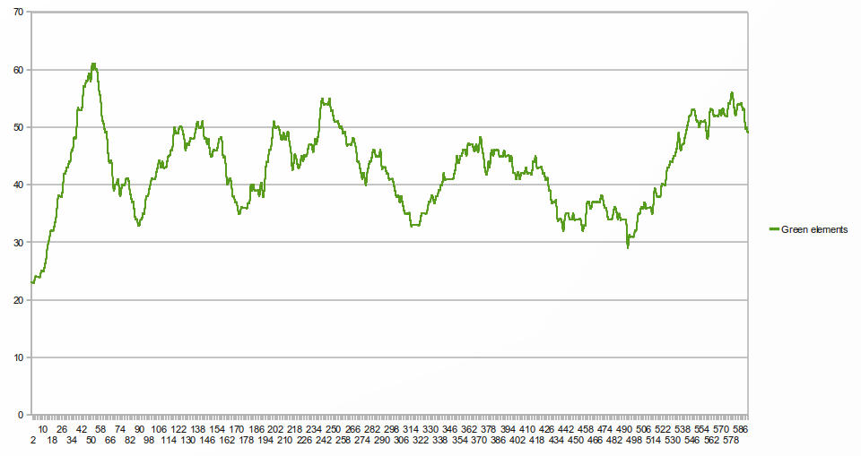
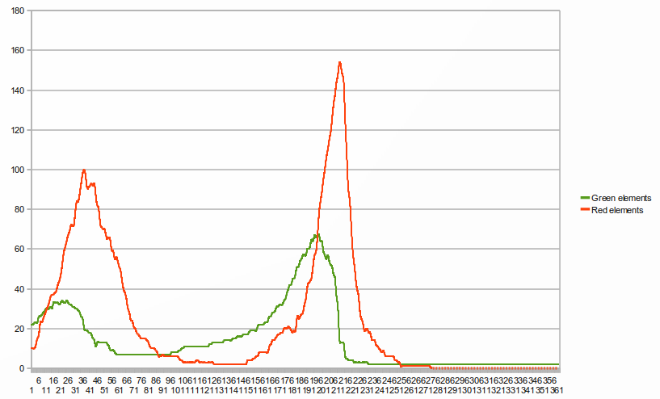

# Simulation au niveau de la population : la problématique proies-prédateurs

## Équilibre proies-prédateurs avec deux espèces

Quand on laisse une population d'êtres-verts évoluer sans prédateurs,
avec juste de l'eau, on a déjà un modèle proies-prédateurs similaire
au modèle de
[Lotka-Volterra](fr.wikipedia.org/wiki/Equations_de_Lotka-Volterra) à
ceci près que la composante positive de la dérivée quantité d'eau est
constante.

L'équation d'évolution d'un système avec des êtres-verts qui se
reproduisent et de l'eau s'écrit :

    dw/dt=alpha-beta*g

    dg/dt=-g*(deta-gamma*w)

Où : 

- **w** est la quantité d'eau disponible
- **g** est le nombre d'êtres-verts
- **alpha** est le facteur de pluie
- **beta** est la vitesse à laquelle les flaques d'eau disparaissent au contact des êtres-verts
- **gamma** est le facteur de reproduction des êtres-verts
- **delta** est la vitesse à laquelle les êtres-verts meurent en l'absence d'eau

En réalité l'équation est un peu plus complexe car la vitesse de
reproduction ne dépend pas directement de la quantité d'eau, mais
dépend par contre du nombre d'êtres-verts au carré.

Cependant, en laissant ce modèle évoluer, on obtient des oscillations
semblables à celles du modèle Lotka-Volterra :

## Équilibre proies-prédateurs avec trois espèces

Avec trois espèces, il est difficile voire impossible d'obtenir un
équilibre. Voici les courbes de l'évolution du nombre d'êtres-verts et
d'êtres-rouges au cours du temps durant une simulation avec des
êtres-verts, des êtres-rouges et de l'eau (quantité d'eau non
représentée) :

