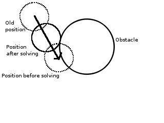
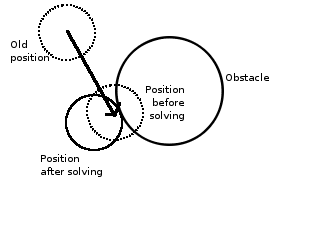

# Gestion des collisions

L'aire de jeu est découpée en cellules de 40x40 pixels. Chaque cellule
maintient en permanence une liste chaînée des éléments présents dans
la cellule. A chaque fois qu'un élément bouge sur la scène, un système
vérifie si l'élément change de cellule. S'il en change, les listes
chaînées sont mises à jour. Ce processus prend un temps en O(1).

Pour savoir si une collision a lieu avec un objet A, on énumère tous
les objets dans les cellules autour de l'objet A et on teste
individuellement si ils sont en contact.  Ainsi on n'a besoin
d'énuméréer qu'un nombre limité d'objets.

Pour éviter que deux objets puissent se superposer, il faut *résoudre
la collision* quand elle se présente. Nous avont expérimenté deux
méthodes pour faire cela :

- Limiter l'amplitude du déplacement à la distance maximale pour
  laquelle il n'y a pas de collision

    

    Dans ce cas la direction du déplacement est préservée,
    c'est-à-dire que l'objet ne sera jamais déplacé selon un axe autre
    que celui demandé, ou encore qu'un être-vert dont la seule
    instruction soit `me.forward(20);` aura toujours la même
    trajectoire peu importe les obstacles rencontrés. Face à un
    obstacle immobile, l'être-vert sera bloqué indéfiniment.

- « Sortir » l'objet de l'obstacle en effectuant le déplacement le plus
  court possible

    

    Dans ce cas l'objet 'glisse' sur les obstacles et ne reste pas
    bloqué. C'est cette approche qui a été choisie pour les
    carpasinivores.

